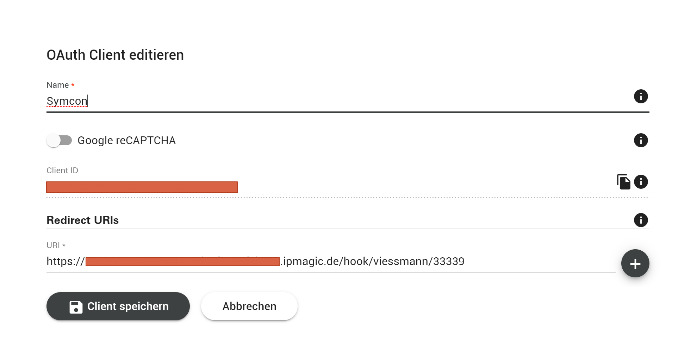

# VitoConnect
Das Modul dient dazu die VitoConnect Cloud-API abzufragen und alle relevanten Informationen über das angeschlossene Viessmann Gerät darzustellen.

> **Hinweis:** Dies ist ein persönlicher Fork. Siehe [Hauptseite](../README.md) für wichtige Hinweise.

### Inhaltsverzeichnis

1. [Funktionsumfang](#1-funktionsumfang)
2. [Voraussetzungen](#2-voraussetzungen)
3. [Software-Installation](#3-software-installation)
4. [Einrichten der Instanzen in IP-Symcon](#4-einrichten-der-instanzen-in-ip-symcon)
5. [Statusvariablen und Profile](#5-statusvariablen-und-profile)
6. [WebFront](#6-webfront)
7. [PHP-Befehlsreferenz](#7-php-befehlsreferenz)

### 1. Funktionsumfang

* Abfrage der Daten, welche über die Cloud-API verfügbar sind
* Ändern von Werten (aktuell nur die Ziel-Temperaturen)
* Zirkulationspumpen-Steuerung über Zeitplan (CreateZirku)

### 2. Voraussetzungen

- IP-Symcon ab Version 6.0
- Symcon Connect (für OAuth-Redirect)
- Viessmann Developer Account mit registrierter ClientID

### 3. Software-Installation

* Über das Module Control folgende URL hinzufügen:
`https://github.com/Benny-FC-Bit/viessmann`

### 4. Einrichten der Instanzen in IP-Symcon

- Unter "Instanz hinzufügen" ist das 'VitoConnect'-Modul unter dem Hersteller 'Viessmann' aufgeführt. Zusätzlich muss eine ClientID über das Developer Portal von Viessmann beantragt werden. Dies ist unter https://developer.viessmann.com/ im Menüpunkt "My Dashbaord" zu finden. Beim erstellen des Clients darf der Name frei gewählt werden - bei der Redirect URI muss die ipmagic.de Adresse eingegeben werden, welche in der VitoConnect Instanz angezeigt wird. Zur Verknüpfung innerhalb der VitoConnect Instanz wird ein aktivierter Symcon Connect benötigt.



__Konfigurationsseite__:

Name            | Beschreibung
--------------- | ---------------------------------
ClientID        | ClientID, welche über https://developer.viessmann.com/ beantragt wurde
Intervall       | Abfrageintervall in Minuten

### 5. Statusvariablen und Profile

Es werden diverse zusätzliche Statusvariablen und Profile erstellt.
Diese sind je nach angeschlossenem Gerät unterschiedlich.

### 6. WebFront

Im WebFront werden alle Variablen angezeigt. Einige sind ggf. schaltbar.

### 7. PHP-Befehlsreferenz

#### VVC_Update(int $InstanzID)
Aktualisiert alle Daten von der Viessmann API.

```php
VVC_Update(36004);
```

#### VVC_StartZirkulation(int $InstanzID, int $Minuten)
Startet die Zirkulationspumpe für die angegebene Dauer. Das Modul übernimmt automatisch:
- Zeitberechnung und Rundung auf 10-Minuten-Intervalle (Viessmann-Vorgabe)
- Sperre gegen Mehrfachauslösung (Variable `ZirkulationAktiv`)
- Zähler für Aktivierungen (Variable `ZirkulationAnzahl`)
- Automatisches Aufräumen nach Ablauf (Timer `ZirkulationStop`)

```php
// Zirkulation für 10 Minuten starten
VVC_StartZirkulation(36004, 10);
```

#### VVC_StopZirkulation(int $InstanzID)
Stoppt die Zirkulation sofort: löscht den Zeitplan und setzt die Sperre zurück.
Wird automatisch nach Ablauf aufgerufen, kann aber auch manuell genutzt werden.

```php
VVC_StopZirkulation(36004);
```

#### VVC_CreateZirku(int $InstanzID, string $Start, string $End, bool $Aktivieren)
> **Veraltet** — nutze `VVC_StartZirkulation()` und `VVC_StopZirkulation()` stattdessen.
> Bleibt für Abwärtskompatibilität erhalten.

```php
VVC_CreateZirku(36004, '06:00', '06:10', true);
VVC_CreateZirku(36004, '00:00', '00:10', false);
```

**Anwendungsbeispiel — Zirkulation per KNX-Taster:**

Ein KNX-Lichtschalter (z.B. im Bad) kann als Auslöser dienen. Das IPS-Skript am Taster ist nur noch eine Zeile:

```php
<?php
VVC_StartZirkulation(36004, 10);
```

Das Modul kümmert sich um alles: Zeitberechnung, Sperre, Zähler und automatisches Aufräumen.

**Sicherheitsjob (empfohlen):**

Falls IPS während einer aktiven Zirkulation neustartet, geht der Aufräum-Timer verloren und der Schedule bleibt bei Viessmann stehen. Als Absicherung einen täglichen Zeitplan (z.B. 02:00 Uhr) einrichten:

```php
<?php
VVC_StopZirkulation(36004);
```
